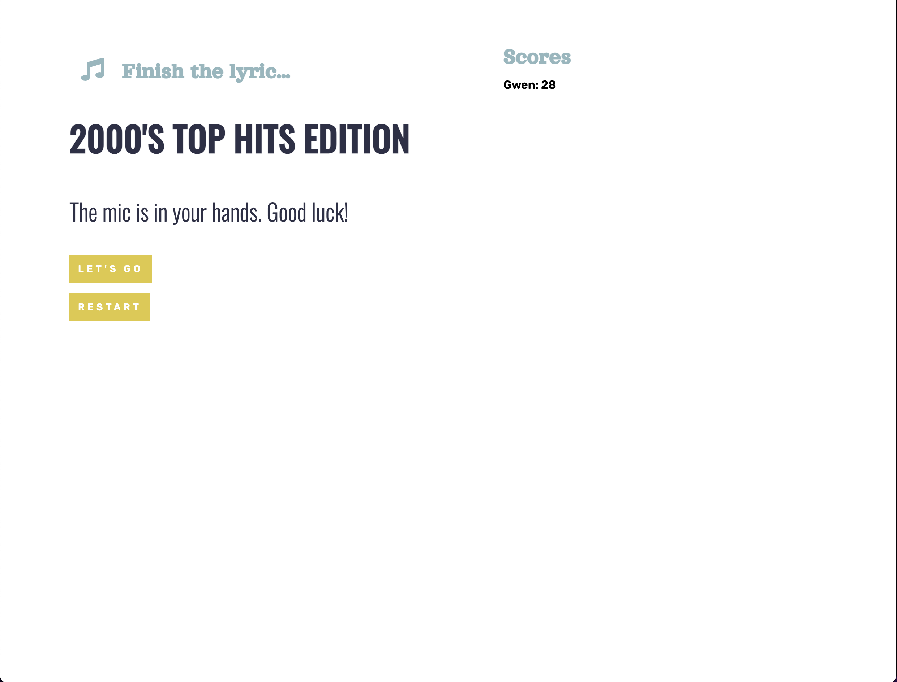

# 09 Node.js Professional README.MD Generator

## Table of Contents:

- [Description](#description)
- [Installation](#installation)
- [Useage](#useage)
- [Contributing](#contributing)
- [Tests](#tests)
- [License](#license)
- [Links](#links)
- [Questions](#questions)

## Description:

My README.MD generator is an application which generates a README.MD file using Inquirer and JavaScript. When a user runs the program in the terminal they are prompted with several inputs about their project including a description, installation instructions, usage, notes on contributions and testing, as well as adding a specified license badge to the file (if they choose no license, the badge and “License” sections disappear), and will also prompt the user to add their Github handle, and link to their profile, as well as a link to their email address for any questions when another developer is downloading their program and wants to get more information. When the user gets to the end of the prompts, they press enter and are given a “Success!” Message in the terminal and the README.MD file they just created is added to their root file structure. The markdown shows a clean hierarchy of text, as well as creates links to Github, the application and the user’s email address.

## Installation:

## Useage:

## Contributing:

## Tests:

## License:

This project is covered under MIT license.

## Screenshot

## Links:

- Project repo: [gwenewasko/repo](https://github.com/gwenewasko)
- Deployed application: [gwenewasko/page](https://github.com/gwenewasko)

## Questions:

- Email address: gwenewasko@gmail.com
- Github profile: [github.com/gwenewasko](https://github.com/gwenewasko)
